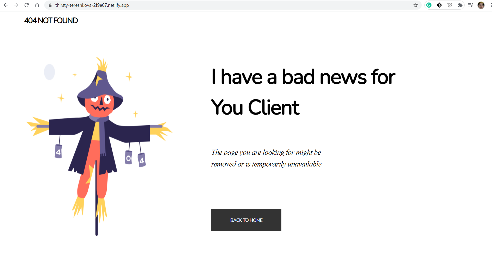

<!-- Please update value in the {}  -->

<h1 align="center">404 Page-Not-Found</h1>

  <h3>
    <a href="https://thirsty-tereshkova-2f9e07.netlify.app">
      Demo
    </a>
  </h3>

<!-- TABLE OF CONTENTS -->

## Table of Contents

- [Overview](#overview)
- [Contact](#contact)

<!-- OVERVIEW -->

## Overview

Introduce your projects by taking a screenshot or a gif. Try to tell visitors a story about your project by answering:

- This Project is Deployed on Netlify.
- Expreience is shit
- I learn Basic - HTML + CSS 
- One Thing is Amazing - We can use a shortcut to insert emoji in Documents or any app in windows --(press window button and .)

## Contact

- GitHub [@yyash01](https://github.com/yyash01)
